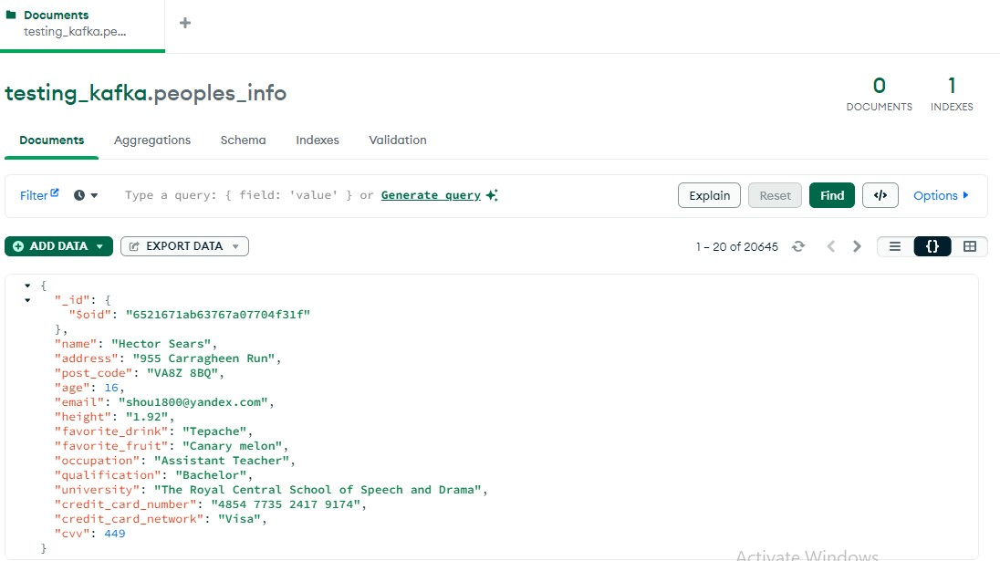

#Kafka-Elastic-Logstash-Kibana-MongoDB Data Pipeline
This repository contain logics of a data pipeline using Kafka and the ELK stack. 

Fake personal information is generated using [Mimesis](https://mimesis.name/en/master/api.html#api-reference) a Python module for producing fake data. The underneath procedure is used to manage data: 
1. A Kafka producer is used to the generated data to produce data to a topic. 
2. Logstash serves as an intermediary that read data from the 'peoples_info_group' topic and then insert them into Elasticsearch.
3. The same data is then persisted into a MongoDB collection
4. Elastic Search stores this data, manages indexes for indexes for searching and analysis, turning raw data into insights.
5. Kibana turns this data into a concrete visualization. 

## Installation
1. Clone the repository: `git clone https://github.com/classicalmuheeb/Kafka_Python_MongoDB`
2. Navigate to the project directory. 
3. Install dependencies: `pip install -r requirements.txt`

## Usage
### To run the application, follow these steps:
1. Start Docker on your system if it's not already running.

2. The Elastic-Logstash-Kibana pipeline is managed using Docker Compose and must also be started. To do this, follow these commands:

   ```bash
   #!/bin/bash
   docker-compose -f zookeeper_docker.yaml up -d

   docker-compose -f elastic_docker.yaml up -d
3. Execute the following command: `python main.py`


